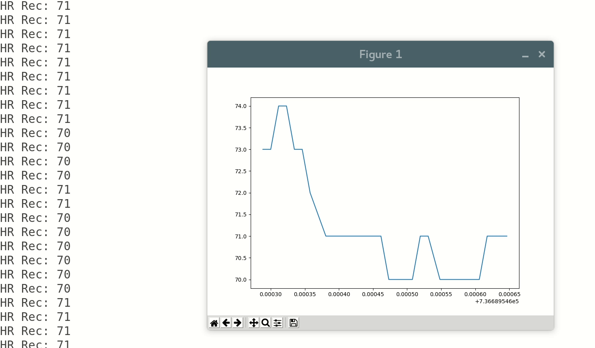

# Polar-H7-PI

Read HR data from the Polar H7 HR monitor using python gatt library.

## Early connection debugging

For initial connection debugging follow [this blog](http://blog.akhq.net/2014/11/polar-h7-bluetooth-le-heart-rate-sensor.html):

Where the second value is the HR (in hex).

```
$ sudo gatttool -b <MAC ADDESS> -I
[<MAC ADDESS>][LE]> connect
Attempting to connect to <MAC ADDESS>
Connection successful
[<MAC ADDESS>][LE]> char-write-req 0x0013 0100
Characteristic value was written successfully
Notification handle = 0x0012 value: 06 3c
Notification handle = 0x0012 value: 16 3c 11 04
Notification handle = 0x0012 value: 16 3c f5 03
...
```
## Storing Data

Use `scan_rec.py` to record datapoints to csv.

Use `analysis.py` to plot these csvs.

## Animated Plot

Use `animated_plot.py` to get a live plot of heart rate data.


